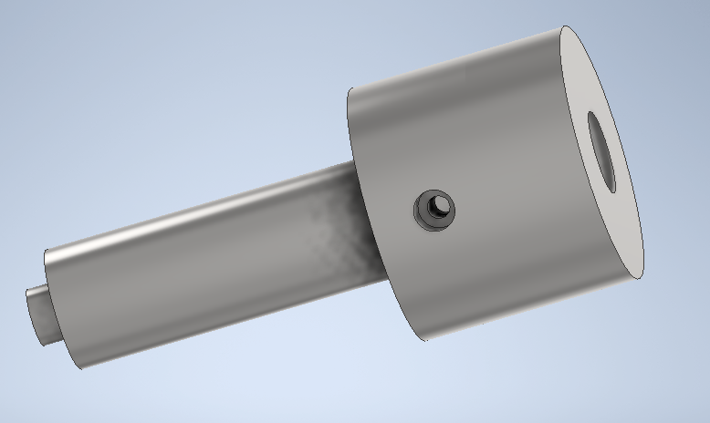
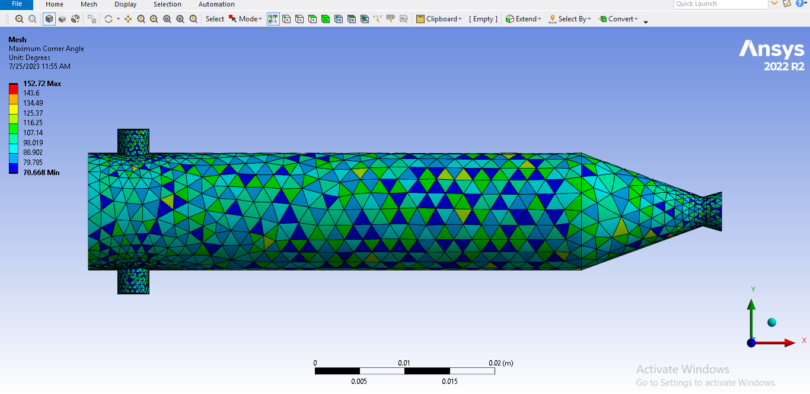

# This directorycontains files for ansys fluent CFD simulation done on the ignitor for the liquid rocket engine.

The 3-D model for the ASI is as shown below:

The scaled residuals obtained from simulaton. (Note: you may have to rerun the simulation to get your desired result or replicate the existing ones)

the following were the models from which a subtractive boolean cut was made. The tool body used is as shown:

and for the target body as shown:

the meshing produced by the Ansys meshing software is as shown:

while the same mesh as displayed within fluent simulation environment is shown:

